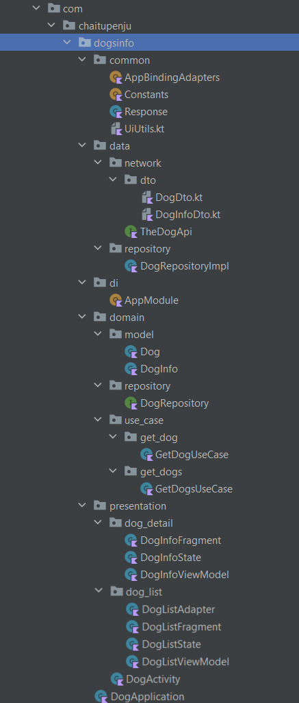

# DogInfoApp
A Simple **Android Application** built using ***MVVM*** and ***Clean Architecture*** which gives basic information about Dogs on this Planet.

### Application Features
 -------------------------
- A Big list of Dogs with images Search functionaliy.
- A Detailed information of particular dog like it's life span, nature, description etc.,
- Support of Light and Dark Themes

### ****Concepts Covered***
----------------------------
- **Clean Architecture** (***Use cases***) using *MVVM*
- Make use of *Shimmer Layout* for Loading animation
- *Hilt* for Dependency Injection
- Image Loading/caching from network using *COIL* (with GIF image loader)
- Networking using *Retrofit* Library
- Coroutines, Android Material, Navigation using Safe Args etc.,

## Project Folder Structure
----------------------------

# App Screens
`Coming SOON....`

# Credits
 - The free open-source API used in this project [**The Dog API**](https://www.thedogapi.com)
 - For Documentation of this API, refer [here](https://docs.thedogapi.com/)

 # License
 Licensed under the [Apache License](LICENSE)